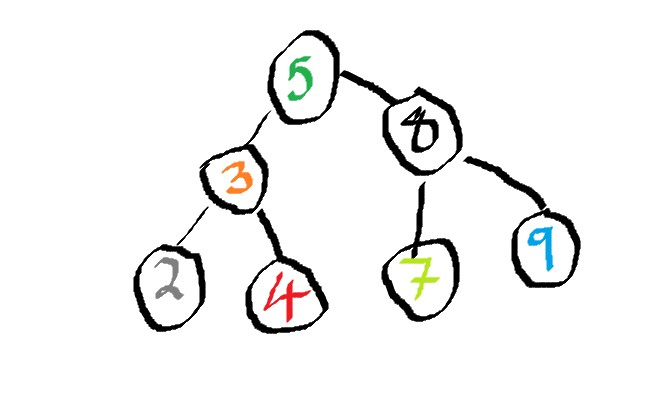

# Topic of Discuss : TREE
[Welcome](0-welcome.md)
## Introduction

Understanding the TREE stack data structure.


In Computer Science, a tree is a widely used abstract data type that represents a hierarchical tree structure with a set of connected nodes. An example of a tree data that's is daily used is a file system.  Each node in the tree can be connected to many children (depending on the type of tree), but must be connected to exactly one parent, except for the root node, which has no parent. These constraints mean there are no cycles or "loops" (no node can be its own ancestor), and also that each child can be treated like the root node of its own subtree, making `recursion` a useful technique for tree traversal. In a file system, directories, or folders, are structured as a tree.

### Recursion

As stated briefly above, we'll have a chance to discuss in little detail recursion in this tree tutorial. In Tree, or programming in general, a recursive data structure is a data structure that is partially composed of smaller or simple instances of the same data structure. For example, linked lists and binary trees can be viewed as recursive data structures. Another example of a recursive data structure is factorial. In factorial, we understand that numbers are broken down into smaller units/pieces. For example, factorial of 6 is the same as `6*5*4*3*2*1` and factorial of 4 is `4*3*2*1`. This process is widely used and important to solve complex problems by breaking them down into simpler ones.

Below is a C# code explaining recursion in a factorial form.

```csharp 
public int Factorial(int n) {
    if (n == 0) {
        return 1;
    }
    else {
        return n * Factorial(n-1);
    }
}
```
## What is the purpose of the TREE data structure?

The tree data structure is used to represent hierarchical relationships between data elements. It consists of nodes connected by edges, where each node represents a data element and the edges represent the relationships between them. The topmost node in a tree is called the root node, and the nodes that have no children are called leaf nodes.

Trees are used in many applications, including:
- Representing file system
- Representing organization charts
- Searching and sorting data
- Representing syntax in programming languages.

## Efficiency of common operations

In C#, the tree data structure is typically implemented using classes and objects. Some common operations on trees in C# are represented in a table below with syntax examples.

Operations | Explanation | Syntax
-----------|-------------|-------
Insertion| Adding a new node to the tree in the appropriate location based on the value of the node.| `Insert(Node root, int value)`
Traversal| Visiting each node in the tree in specific order| `InOrderTraversal(Node root)`
Searching| Finding a specific node in the tree based on its value.| `Search(Node root, int value)`
Deleting| Removing a node from the tree while maintaining its structure and ordering.| `Delete(Node root, int value)`
Height calculation| Determining the height of the tree, which is the length of the longest path from the root to a leaf node.| `int CalculateHeight(Node root)`
Subtree operations| Performing operations on subtrees of the tree, such as finding the maximum or minimum value in a subtree.| `void InOrderTraversalSubtree(Node root, Node subRoot)`
Balance| Reorganizing the tree to maintain a balanced structure, which can help to improve performance in certain applications.| `bool IsBalanced(Node root)`


## What is the performance of the data structure 
The most efficient time complexity performance for a tree data structure in terms of search, insertion, and deletion is O(log n) for balanced binary search trees like AVL trees and red-black trees. This time complexity is achieved by keeping the tree height balanced, which ensures that the number of nodes visited during each operation is proportional to the logarithm of the number of nodes in the tree.

The table below shows the various operations and their time complexity.

Operations| Time Complexity/Performance
----------|----------------------------
Search| `O(log n)`
Insert| `O(log n)`
Delete| `O(log n)`
Traversal| it takes `O(n)` To traverse all the nodes in a tree
Height Calculation| `O(n)`
Subtree Operations| `O(n)`


## How would the data structure be used in C#
Below, we'll highlight an example of a problem that can be solve using the tree data structure, and we'll explain the process to achieving this.

## Example

Find the lowest common ancestor (LCA) of two nodes in a binary search tree.


The LCA of two nodes in a binary search tree is the lowest node in the tree that has both nodes as descendants. For example, in the following binary search tree:
```csharp
class TreeNode {
    public int val;
    public TreeNode left;
    public TreeNode right;
    public TreeNode(int val=0, TreeNode left=null, TreeNode right=null) {
        this.val = val;
        this.left = left;
        this.right = right;
    }
}

public class Solution {
    public TreeNode LowestCommonAncestor(TreeNode root, TreeNode p, TreeNode q) {
        if (root == null || p == null || q == null) {
            return null;
        }
        if (root.val > p.val && root.val > q.val) {
            return LowestCommonAncestor(root.left, p, q);
        } else if (root.val < p.val && root.val < q.val) {
            return LowestCommonAncestor(root.right, p, q);
        } else {
            return root;
        }
    }
}
```
The LowestCommonAncestor method takes in the root node of the binary search tree, as well as two nodes p and q whose LCA we want to find. It returns the LCA of the two nodes.

The method works by recursively traversing the tree. If the current node's value is greater than both p and q, we know that the LCA must be in the left subtree. If the current node's value is less than both p and q, we know that the LCA must be in the right subtree. Otherwise, the current node is the LCA.

To use this method, we can create a binary search tree and call the LowestCommonAncestor method with the root node and the two nodes whose LCA we want to find. For example:
```csharp
TreeNode root = new TreeNode(5);
root.left = new TreeNode(3, new TreeNode(2), new TreeNode(4));
root.right = new TreeNode(8, new TreeNode(7), new TreeNode(9));

Solution solution = new Solution();
TreeNode lca = solution.LowestCommonAncestor(root, root.left.left, root.right.left);
Console.WriteLine(lca.val); // Output: 5
```
In this example, we create a binary search tree with the same structure as the one shown earlier, and then call LowestCommonAncestor with nodes 2 and 7 to find their LCA. The output is 5, which is the value of the LCA node.

## Problem to Solve

Given a binary search tree and a target value, implement a function SearchBST to search for the target value in the tree. If the value is found, return the corresponding node; otherwise, return null.
```csharp
class TreeNode {
    public int val;
    public TreeNode left;
    public TreeNode right;
    public TreeNode(int val=0, TreeNode left=null, TreeNode right=null) {
        this.val = val;
        this.left = left;
        this.right = right;
    }
}
public TreeNode Insert(TreeNode root, int val) 
{
    //YOUR CODE SOLUTION HERE
}

TreeNode root = new TreeNode(4);
root.left = new TreeNode(2, new TreeNode(1), new TreeNode(3));
root.right = new TreeNode(7);

Insert(root, 5);

void InOrder(TreeNode node) 
{
    //YOUR CODE SOLUTION HERE
}
InOrder(root); 
// Output: 1 2 3 4 5 7
```
[Problem Solution](5-C%23File.md)

In this solution, we define a TreeNode class to represent nodes in a binary search tree. Each node has a value, as well as references to its left and right child nodes.

We then define a method called Insert that takes in the root node of a binary search tree and a value to insert, and inserts the value into the tree in the correct position according to the binary search tree property. The method works by recursively traversing the tree and comparing the current node's value to the value to be inserted. If the value to be inserted is less than the current node's value, we recursively insert it into the left subtree; otherwise, we recursively insert it into the right subtree.

Finally, we create a binary search tree with the root value of 4 and two child nodes, and call the Insert method to insert the value 5 into the tree. We then traverse the tree in-order to confirm that the insertion was successful, and the output is the values 1, 2, 3, 4, 5, 7 in order.

## Explain what kind of error are common using this data structure.
Some common errors in tree data structure operations include:

Null pointer exceptions: These occur when attempting to access a node or value in a tree that is null, such as trying to access the left or right child of a leaf node.

Off-by-one errors: These occur when counting the height or number of nodes in a tree, and accidentally including or excluding a node or subtree.

Incorrect tree traversal: These occur when traversing the tree in the wrong order or using the wrong traversal algorithm, resulting in incorrect node values or missing nodes.


## [Picture Explanation on Tree](4-pictureFile.md)
## [Csharp Code on Tree](5-C%23File.md)
## [Other Files Including Tables](6-otherFiles.md)