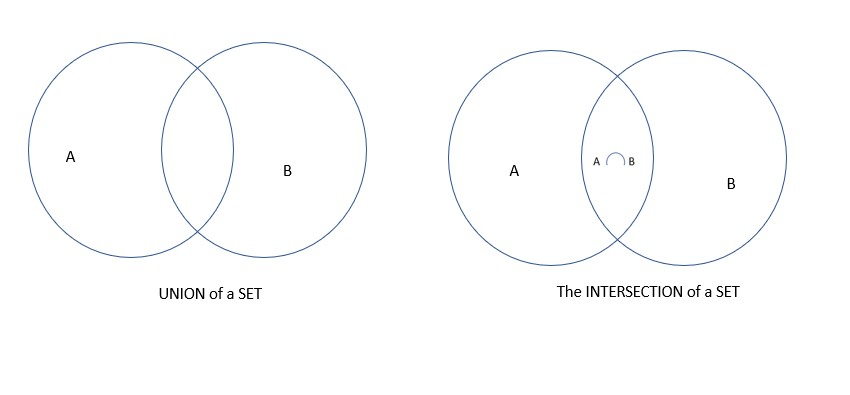

# Stack Image example


It always takes the same amount of time to find the first element in the array. In a graph, it would look like this:


An example of a O(1) performace in c sharp is shown and explain below.

```csharp
Stack<int> stack = new Stack<int>();
stack.Push(5); 
int topItem = stack.Peek();
int poppedItem = stack.Pop(); 
```
The second line push an item onto the stack, the third line get the item without removing it, and finally the fourth line remove and return the top item from the tack.

# SET Union and Intersection Diagram Explain

The diagram below gives a clear explanation of a set union and intersection, and how it is implemented.



The diagram on the left is a simple diagram of a `Union` of a set.

The union of two sets A and B is a new set that contains all the unique elements from both sets. In other words, it combines the elements from A and B into a single set, without repeating any elements.

For example, if we have two sets A = {1, 2, 3} and B = {3, 4, 5}, then the union of these sets, A ∪ B, is {1, 2, 3, 4, 5}.

The diagram on the right is a simple diagram of a set `Intersection.`

Set intersection is an operation that returns a new set containing only the elements that are common to both sets. In other words, it produces a set that contains only the elements that appear in both sets A and B.

For example, if we have two sets A = {1, 2, 3} and B = {3, 4, 5}, then the intersection of these sets, A ∩ B, is {3}, since 3 is the only element that appears in both sets.

# Simple Tree Diagram example

This tree is a nonlinear hierarchical data structure and comprises a collection of entities known as nodes.


[Back to Stack Homepage](1-topic.md)

[Back to Set Homepage](2-topic.md)

[Back to Tree Homepage](3-topic.md)