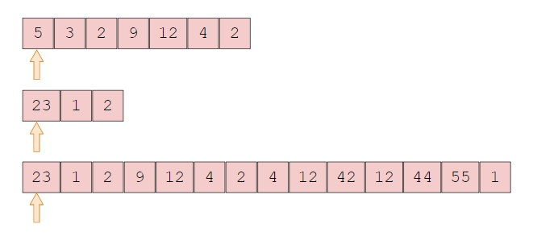
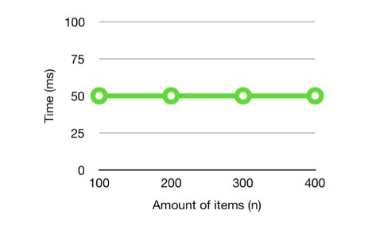

# Topic of Discuss : STACK
[Welcome](0-welcome.md)
## Introduction

## Understanding the stack data structure 

A stack is a type of data structure in a program by which data are allowed to be stored and retrieved in a last-in, first-out (LIFO) order. A simple example of this is a stack of plates, the last plate to be stack is the first plate that is removed from the stack. 

# What is the purpose of the (Stack) data structure?
The purpose of a stack in a program is to allow data to be stor and manage in a way that those data are preserved in the order which they are added. The two basic operations that can be perform with stacks are 
[Push](https://afteracademy.com/blog/stack-and-its-basic-operations/#:~:text=Push%20operation%20refers%20to%20inserting,the%20top%20of%20the%20stack.) and [Pop](https://afteracademy.com/blog/stack-and-its-basic-operations/#:~:text=Push%20operation%20refers%20to%20inserting,the%20top%20of%20the%20stack.). However there are other operations like PEEK and isEmpty that can also be perform. The stack data structure is useful in many programming scenarios, such as parsing expressions, tracking the execution of function calls, undo/redo operations in text editors.
A simple example of some purpose of stack is mentioned and implemented below. 
* ## Parsing function call
A function call enables the computer to allocate new block of memory to for that function, and stack data structure is usually used to keep track of this call. When parsing a function call, bear in mind that all features associate with that function is called. What this means is, when a function is called information such as function arguments, local variables, and the return address is implemented. A c sharp example is shown below: 

In this example we want to implement a function that will add numbers function with two integer arguments, and storing the result in a variable name result.


```csharp
int result = AddNumbers(5, 7);
Console.WriteLine("The result is: "+ result); 

Int AddNumbers(int num1, int num2){
    return num1 + num2;
}
```
The Add numbers function itself is defined with two integer parameters, and simply return the sum of the two arguments.

* ## Tracking the execution of function calls
Another purpose of stack is tracking the execution of function calls. Tracking the execution of function calls in a stack involves keeping track of the current stack frame and updating it as the program executes function calls and returns. 

Below is a c sharp example of tracking the execution of a function call.

```csharp
public void Main()
{
    int result = AddNumbers(5, 10);
    Console.WriteLine($"Result of adding 5 and 10 is: {result}");
}

public int AddNumbers(int num1, int num2)
{
    Console.WriteLine($"Executing AddNumbers function with arguments: {num1} and {num2}");
    int sum = num1 + num2;
    Console.WriteLine($"Returning sum of {num1} and {num2}: {sum}");
    return sum;
}
```
In the Main() function, we're calling the AddNumbers() function with arguments 5 and 10. Within the AddNumbers() function, we're printing out a message to the console indicating that we're executing the function with those arguments. We then calculate the sum of num1 and num2, and print out another message to the console indicating that we're returning the sum. Finally, we return the sum back to the Main() function, where we print out the result to the console.

The [table](6.otherFiles.md) represent how function calls are being track. 
# What is the performance of the data structure 
All operations in stack must be of O(1) time complexity. The push and pop operation is a perfect example of O(1). This means all item inserted on a stack follows one step eachto complete the entire process. The process is constant which means it will always run  in the same amount of time, no matter the input size. For example, if we want to get the first item of an array, it doesn’t matter how big the input size is. 



It always takes the same amount of time to find the first element in the array. In a graph, it would look like this:



An example of a O(1) performace in c sharp is shown and explain below.
```csharp
Stack<int> stack = new Stack<int>();
stack.Push(5); 
int topItem = stack.Peek();
int poppedItem = stack.Pop(); 
```
The second line push an item onto the stack, the third line get the item without removing it, and finally the fourth line remove and return the top item from the tack.


## Efficiency of common operations
The efficiency of common operations like push, pop, peek are O(1). A Stack is a Linear Data Structure in which Operations are performed in a specific order known as LIFO(Last In First Out) or FILO (First In Last Out). Operations on Stack occur only at one end called as the TOP of the stack. In all of this, both worse case and best case scenerio for this operation is O(1).


# Problem to Solve (Example)
As we have discussed so far on Stack data structure, we have highlighted and explain the following for better understanding. This include,
- Understanding the stack data structure 
- What is the purpose of the (Stack) data structure? 
and for this two purpose was mentioned and discussed with examples. these are
    - Parsing function call
    - Tracking the execution of function calls
- What is the performance of the data structure 
- Efficiency of common operations

In continuation, we are going to highlight common problems that can be solve with the stack data structure using c sharp, and also putting into full consideration the time complexity of O(1) while we implement the solution.

## 1. Example:

Reverse a string using a stack: Push every character of the string onto a stack and then pop each character off the stack to get the reversed string.

```csharp
public static string ReverseString(string str)
{
    Stack<char> stack = new Stack<char>();
    foreach (char c in str)
    {
        stack.Push(c);
    }
    string reversedString = "";
    while (stack.Count > 0)
    {
        reversedString += stack.Pop();
    }
    return reversedString;
}
```
In this code, we create a new stack of characters Stack<char> stack = new Stack<char>() and iterate over each character in the input string str. We push every character onto the stack using stack.Push(c). We then create an empty string reversedString and pop each character off the stack using stack.Pop() and append it to the string. Finally, we return the reversed string.

So, the output of this program will be the reverse of the input string.

## 2. Example:
Given a string with parentheses, write a function to determine if the parentheses are balanced. A string is considered balanced if it consists entirely of pairs of opening/closing parentheses (in that order), and for every opening parenthesis there is a corresponding closing parenthesis.

```csharp
public static bool IsBalanced(string str)
{
    Stack<char> stack = new Stack<char>();
    foreach (char c in str)
    {
        if (c == '(')
        {
            stack.Push(c);
        }
        else if (c == ')')
        {
            if (stack.Count == 0 || stack.Pop() != '(')
            {
                return false;
            }
        }
    }
    return stack.Count == 0;
}
```
This function uses a stack to keep track of opening parentheses. It iterates over each character in the input string str, and if the character is an opening parenthesis, it pushes it onto the stack. If the character is a closing parenthesis, it pops the top character off the stack and checks if it matches the corresponding opening parenthesis. If the stack is empty or the parentheses don't match, the function returns false. If the function makes it through the entire loop without returning false, it checks if the stack is empty and returns true if it is. This indicates that all parentheses were balanced.

So, if we call the IsBalanced method with the input string "((()))", the output would be true as this string has balanced parentheses. If we call the IsBalanced method with the input string "(()))", the output would be false as this string does not have balanced parentheses.


# How would the data structure be used in C#

To successfully implement a stack data structure in C# certain operations are put to use. These operations makes it so that the particular task that's needed to be perform is successfully perform.Some of these operations like push and pop were mentioned initially in this tutorial, but the more of them are listed below and explain below.
- Push: `stack.Push(1)`, `stack.Push(2)`, `stack.Push(3)` This push operations makes it possible for us to push three integer number or element into the tack structure.
- Pop: we use `stack.Pop(3)` to pop out the first value in the stack and print it using the `console.WriteLine()` command in C# to print it on screen.
- Peek: `stack.Peek()` this operations makes it possible for us to peek out the top value of the stack without removing it. and print it on screen using the command `console.WriteLine()`.
- Contains: Contains operation check if the stack contains the value using `stack.Contain(1)` and then print it using `console.WriteLine()`.
- Array: We copy the stack to an array using this command `int[] array = stack.ToArray()`. 
- Clear: And finally we use the `stack. Clear()` operation to clear the stack.

# Explain what kind of error are common using this data structure.
Some common errors that can occur when using stack data structure in C# are:

1. Stack overflow error: This occurs when the stack becomes too large and exceeds its maximum capacity. To prevent this error, it is important to make sure that the stack is not being used excessively and to increase the stack size if necessary.


2. Invalid operation exception: This occurs when trying to perform an operation that is not supported by the stack, such as trying to remove an item from an empty stack. To prevent this error, it is important to check if the stack is empty before performing operations that require items to be present.

3. Index out of range exception: This occurs when trying to access an element that is outside the range of the stack. To prevent this error, it is important to make sure that the index is within the range of the stack before accessing it.

4. Null reference exception: This occurs when trying to access an object that is null. To prevent this error, it is important to check that the object is not null before accessing it.


## [Picture Explanation on stack](4-pictureFile.md)
## [Csharp Code on stack](5-C%23File.md)

## [Other Files Including Tables](6.otherFiles.md)