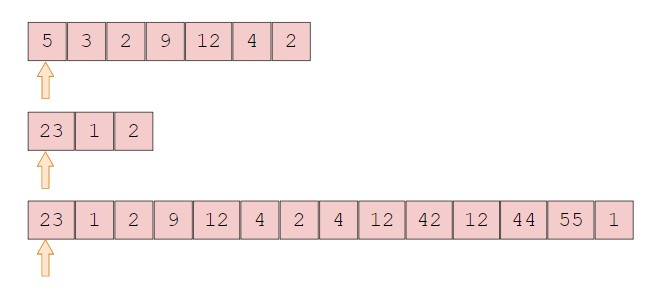
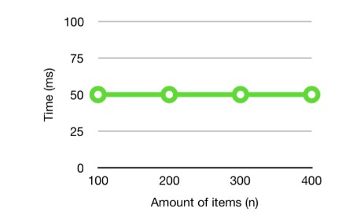

# Stack Image example



It always takes the same amount of time to find the first element in the array. In a graph, it would look like this:



An example of a O(1) performace in c sharp is shown and explain below.

```csharp
Stack<int> stack = new Stack<int>();
stack.Push(5); 
int topItem = stack.Peek();
int poppedItem = stack.Pop(); 
```
The second line push an item onto the stack, the third line get the item without removing it, and finally the fourth line remove and return the top item from the tack.

[Back to Stack Homepage](1-topic.md)